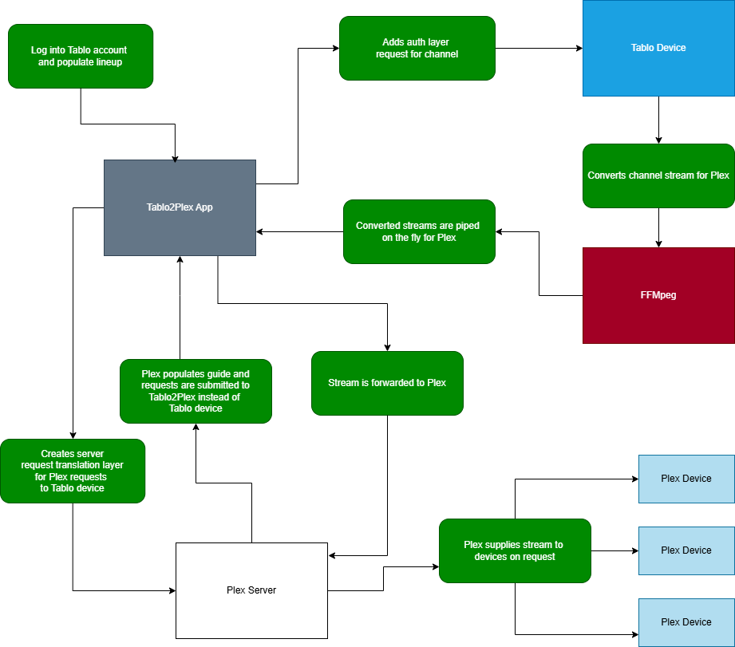

# Tablo2Plex: HDHomeRun Proxy for Tablo TV (4th Gen)


__Tablo2Plex__ is a Node.js-based server app that emulates an HDHomeRun device to allow Plex to access live TV streams from a Tablo 4th Gen device. It dynamically proxies Tablo's M3U8 `.ts` segment streams and serves them in a format Plex understands, enabling live playback and DVR functionality within Plex.

## Features

- 🧠 Emulates HDHomeRun's API (`discover.json`, `lineup.json`, etc.)
- 🔁 Parses dynamic M3U playlists from Tablo on demand
- 🎥 Streams `.ts` segments using FFmpeg via a unified stream endpoint
- 📺 Compatible with Plex Live TV & DVR interface
- 🔒 Encrypts your personal Tablo credentials
---

## Preface

With the Tablo 4th Gen devices, they added an Auth layer to their communications so you can't independently interact with them on your network. You are now forced to use only the official Tablo 4th Gen apps that are either poorly supported or non existent (see Windows). I wanted to not only fix that but expand the devices it supports while allowing you to take your streams with you wherever you go. That's how __Tablo2Plex__ was born! You can now use your Tablo device on any device that supports Plex, anywhere you go with it!

How it works:



## Getting Started

### Prerequisites

- Node.js (to build, or use the pre-built app in [releases](https://github.com/hearhellacopters/tablo2plex/releases))
- FFmpeg installed and in your system path (include in [releases](https://github.com/hearhellacopters/tablo2plex/releases))
- Tablo account in good standing with a Tablo TV 4th Gen device on your local network, completely set up and activated
- Plex account with Plex Pass

### Installation

It's recommended that __Tablo2Plex__ runs on the same device as your Plex server for best performance. But as long as it's on the same network as both the Plex server and the Tablo device, it will work.

If you want to run the proxy a Node package:

```bash
git clone https://github.com/hearhellacopters/tablo2plex.git
cd tablo2plex
npm install
```

If you want to run the proxy as a pre-built app, check out the [releases page](https://github.com/hearhellacopters/tablo2plex/releases) and simply download it there. Can you also build your own with:

```bash
npm run build:win # or
npm run build:linux # or
npm run build:mac:arm # or
npm run build:mac:x64
```

**Note: Don't build for a system you aren't currently running.** Mac needs code signing and that is only possible on a Mac machine.

### Configuration

Use the ``.env`` file to change options for you would like to use the Tablo device and proxy.

|Variable |Desc     |
| :---    | :---  |
|``PORT`` | Change the port the app runs on (default ``8181``)|
|``LINEUP_UPDATE_INTERVAL``| How often the app will repopulate the channel lineup. Default once every ``30`` days. Can be triggered any time the proxy is running.|
|``OTT_SETTINGS``| How to handle ott "over-the-top" internet channels that Tablo comes with it that doesn't use the device (ota "over-the-air" channels) to access (read more about it in the [OTT](#ott) section). You can ``remove`` them from the line up, ``include`` them or ``split`` them to a second proxy on a different port (for easier guide population). Default is to ``include`` them in the main proxy (you can also uncheck them from the Plex server guide)|
|``PORT2``| The second port to use when you want to split out ott channels. Default ``8182`` |
|``LOG_LEVEL``| The amount of data you would like to see in the console. Default ``error`` and lower|
|``SAVE_LOG``| Create a file of all console output to the /logs folder. Default ``false``|

## Running the Proxy

If you aren't using the pre-built app you can run the Node package with:

```bash
node app.js # or
npm run start
```

If you want to use the pre-build app, check out the [releases page](https://github.com/hearhellacopters/tablo2plex/releases).

When you first run the proxy, you will be asked to log into your Tablo account by providing your email and password. **Note: Your email and password are never stored locally and all returned credentials are stored encrypted.** But when you first log in, your password and email is transmitted in plain text (nice one Tablo). So please don't setup the proxy on an untrusted network. 

It will ask you to select a profile or device if there is more than one on your account. Once done, it will download the channel lineup and start the proxy.

Besides the ``.env`` settings, you can run the proxy with a command line to force some actions: 

|Command |Desc     |
| :---    | :---  |
|``-c, --creds``| Force the app to ask for a login again to create new credentials files (checks every time the app runs)|
|``-l, --lineup``| Force the app to pull a new channel line up from the Tablo servers, good if you changed a setting in the ``.env`` file (can be done at anytime while running)|

### Plex Setup

1. Open Plex and go to **Live TV & DVR > Setup**
2. Plex should detect the device proxy automatically, if not you can add the displaying http address and port from the proxy.
3. Follow the guide scan using a ZIP code*
4. Start watching live TV via Tablo!

*The 4th Gen Tablo devices no longer populate the channel guide through the device. The Tablo apps connects to a 3rd party that populates it within the Tablo app so it can control the DRV and many other features. In the interest of keeping things simple, I didn't spend the time converting their 3rd party guide data, so you must use the Plex's guide data instead.

## OTT

Tablo comes with ott (over-the-top) internet channels that don't require the device to use. Some of these are likely not normal channels so you can't get the guide information outside of the Tablo app. Instead of spending time and resources having to make the server constantly downloading and converting that guide data, we have a few options for how we can handle this channels. You can either include them in the whole lineup and see if your Plex has the guide data or split them to their own port and have Plex view all these channels are a whole different device (or just not include them). This can be controlled in the ``OTT_SETTINGS`` in the ``.env`` file.

---

## License

MIT License

---

## Credits

Built with ❤️ by HearHellacopters 
